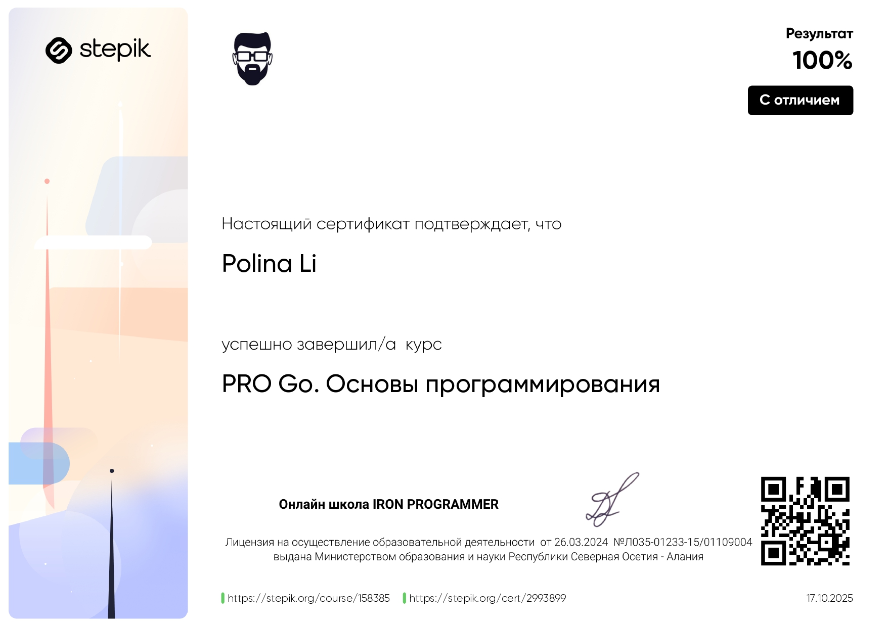

# x-o-console-game
<h2>Консольная игра "Крестики-нолики", разработанная в качестве дипломного проекта курса "PRO Go. Основы программирования" на Stepik.</h2>
## 📋 О проекте

Проект демонстрирует: 
- Базовые принципы программирования на Go 
- Работу с массивами и циклами 
- Организацию кода через функции 
- Обработку пользовательского ввода 
- Валидацию данных

## 🛠 Технологии

- Go 1.19+ 
- Стандартная библиотека Go (fmt)

<h1>🎮 Как играть</h1>

  1. Игроки по очереди вводят цифры от 1 до 9 
  2. Каждая цифра соответствует ячейке поля.

#Этот проект был выполнен в рамках дипломной работы курса "PRO Go. Основы программирования" на платформе Stepik.
https://stepik.org/course/158385/syllabus

